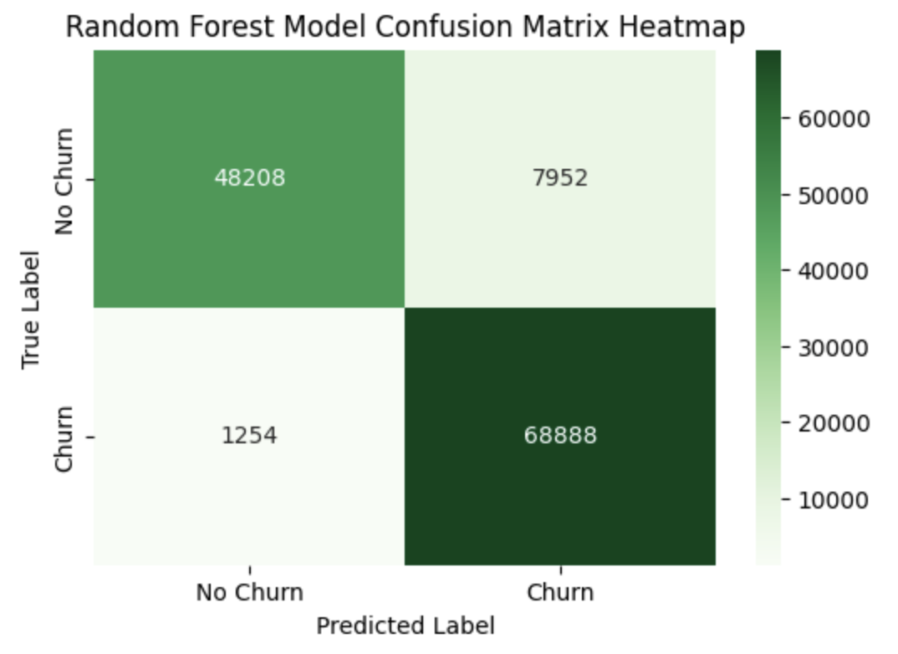
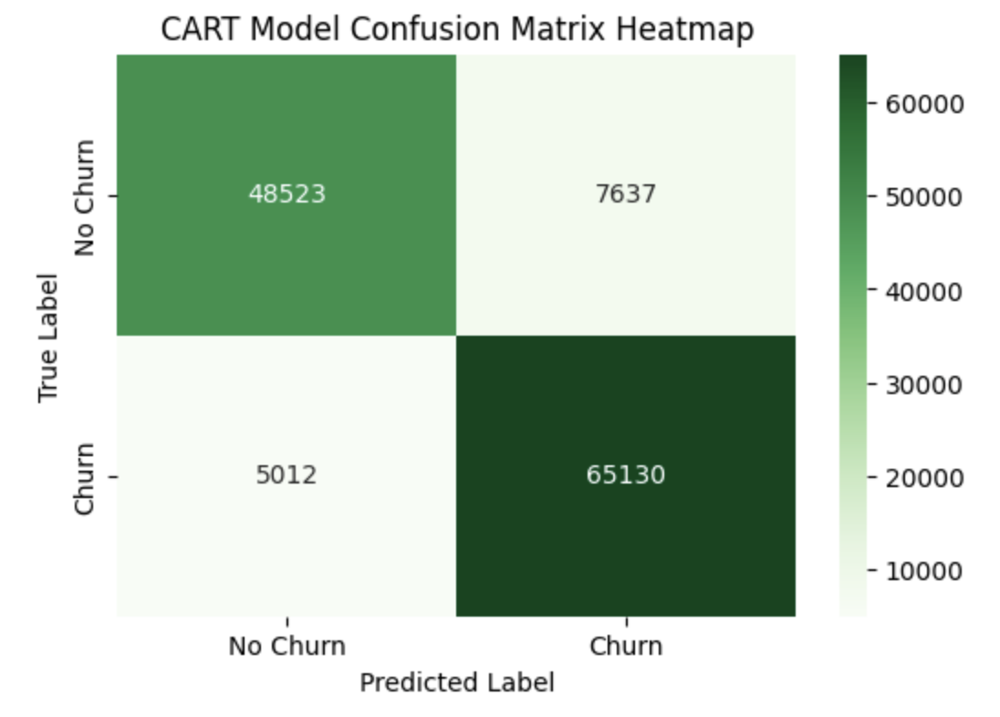
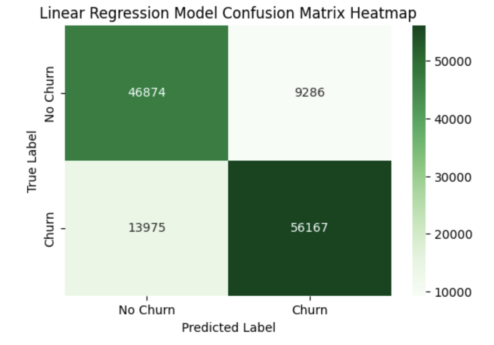

# 📊 Customer Churn Prediction

Predicting customer churn using CART decision trees, random forests, and multiple linear regression on a dataset with 500,000+ entries.

---

## Overview

In 2024, I participated in Carnegie Mellon University's four-week summer program intended to introduce students from around the country to Python, data science, and machine learning. Paired up with a professor, our team was tasked with parsing through this dataset of customer records and determining the top three factors that contributed to a customer churning their subscription. Defined by when customers stop doing business with a company, understanding and analyzing why customers churn is extremely important as businesses aim to increase their growth and profitability. The results slightly changed during my second attempt at this objective, but the procedures remained the same.

---

## Dataset

- **Source:** [Kaggle Customer Churn Dataset](https://www.kaggle.com/datasets/muhammadshahidazeem/customer-churn-dataset) (Modified)
- **Size:** 505,206 entries
- **Features:** Customer ID, age, gender, tenure, usage frequency, support calls, payment delay, subscription type, contract length, total spend, last transaction, churn
- **Target variable:** `Churn` (binary)

---

## Results

The three models were first trained and evaluated using Mean Squared Error (MSE) and Mean Absolute Error (MAE):

| Model | MSE | MAE |
|---|---|---|
| Random Forest | **0.0731** | **0.0731** |
| CART Decision Tree | 0.1001 | 0.1001 |
| Multiple Linear Regression | 0.1456 | 0.3170 |

Our **KPI** (Key Performance Indicator) was **Mean Absolute Error** (MAE) during the original capstone as we chose not to remove our outliers from the dataset before doing our analysis. MAE is less sensitive to outliers, meaning that the results of our algorithms were less swayed by having wider margins in terms of age and tenure. 

**Random Forest was the best-performing model**, with the lowest error across both metrics.

That being said, I went back to create classification reports and confusion matrices for each model (separate from our learning exercise), aiming to give clearer insights as to how each model performed when determining if a customer would or would not churn. With new ways of evaluating the data, the RF model continued to prove itself as the best option. It caught 98% of churners, while the CART model and Multiple Linear Regression model missed significantly more.

### Confusion Matrix (Random Forest)



### Classifcation Report (Random Forest)

|  | Precision | Recall | F1-Score | Support |
|---|---|---|---|---|
| No Churn | 0.97 | 0.86 | 0.91 | 56,160 |
| Churn | 0.90 | 0.98 | 0.94 | 70,142 |
| Accuracy |  |  | 0.93 | 126,302 |
| Macro Avg | 0.94 | 0.92 | 0.93 | 126,302 | 
| Weighted Avg | 0.93 | 0.93 | 0.93 | 126,302 |

### Confusion Matrix (CART Decision Tree)



### Classifcation Report (CART Decision Tree)

|  | Precision | Recall | F1-Score | Support |
|---|---|---|---|---|
| No Churn | 0.91 | 0.86 | 0.88 | 56,160 |
| Churn | 0.90 | 0.93 | 0.91 | 70,142 |
| Accuracy |  |  | 0.90 | 126,302 |
| Macro Avg | 0.90 | 0.90 | 0.90 | 126,302 | 
| Weighted Avg | 0.90 | 0.90 | 0.90 | 126,302 |

### Confusion Matrix (Multiple Linear Regression)



### Classifcation Report (Multiple Linear Regression)

|  | Precision | Recall | F1-Score | Support |
|---|---|---|---|---|
| No Churn | 0.77 | 0.83 | 0.80 | 56,160 |
| Churn | 0.86 | 0.80 | 0.83 | 70,142 |
| Accuracy |  |  | 0.82 | 126,302 |
| Macro Avg | 0.81 | 0.82 | 0.81 | 126,302 | 
| Weighted Avg | 0.82 | 0.82 | 0.82 | 126,302 |

## Top Features

### Main Indicators

1. Support Calls (Score > 0.20)
2. Total Spend
3. Age (Payment delay in the original project)


### Prediction Values Correlation Matrix

| Feature | Correlation |
|---|---|
| Support Calls | +0.5163 (strongest positive predictor) |
| Payment Delay | +0.3298 (second strongest positive) |
| Age | +0.1912 (third strongest positive) |
| Total Spend | −0.3697 (strongest negative predictor) |
| Usage Frequency | -0.0533 (second strongest negative) |
| Tenure | -0.0213 (third strongest negative) |
<br>


---

## Key Takeaways

- Customers with **high support call volume** are the strongest churn signal — companies should invest in more customer service training and larger teams. Nearly three out of five customers report that good customer service is vital for them to feel loyalty toward a brand *(Zendesk, 2018)* Furthermore, 68% of customers say that they are willing to pay more for products and services from a brand known to offer good customer service experiences *(HubSpot, 2018)*
   - The data analysis showed that ⅓ of customers in this dataset churned as a result of having 5 or more support calls.
- Customers with **higher total spend** are actually *less* likely to churn, suggesting loyalty among higher-value customers. That being said, customers will want to move their money away from the company if the service they receive is poor or unsatisfactory.
   - 65% of customers say that they have changed to a different brand because of a poor experience *(Khoros, 2024)*
- **Random forests significantly outperformed** both the CART baseline and linear regression, reducing MSE by ~27% over CART. Its recall being 98% when it comes to correctly identifying churn is key, since it only misses 1,254 customers out of 70,142. There were still 7,952 false positives, but wasted retention efforts are much less costly than losing customers.
   - Specifically for MLR, it's likely that the poor performance was due to it being less suitable for classification tasks such as this one. With the new addition, it's easier to see its weakness compared to the other two models. It misses 13,975 churners which is over 11x more than the top performing model. Objectively, it's an unsafe option for businesses to use in this scenario.

---

## Setup

### Prerequisites

```bash
pip install -r requirements.txt
```

### Running the Notebook

```bash
git clone https://github.com/eliasangelss/customer-churn.git
cd customer-churn
jupyter notebook model.ipynb
```

---

## Project Structure

```
customer-churn/
├── model.ipynb       # Includes analysis, modeling, evaluation, and my notes
├── churn.csv         # Dataset
├── requirements.txt  
└── README.md
```

---


## Model Architecture

### *CART Model*
- **Max Leaf Nodes:** 5
- **Criterion:** Gini

### *Random Forest Model*
- **Number of Estimators:** 10
- **Criterion:** Gini


---

## Tools & Libraries

- Python, Jupyter Notebook
- scikit-learn (CART, Random Forest, Linear Regression)
- pandas, NumPy
- matplotlib, seaborn, statsmodels

---

## License

MIT
